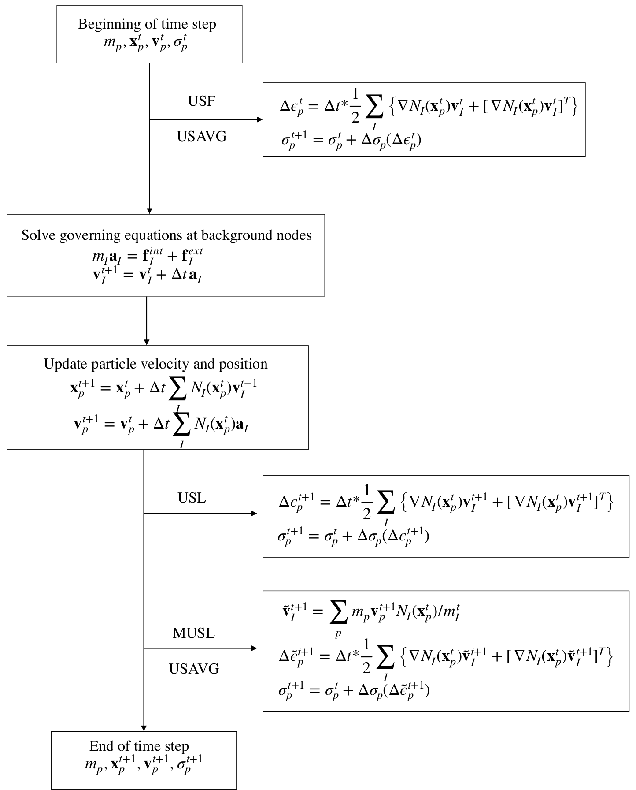

# MPM Explicit

MPM automatically satisfies the mass conservation by assigning a constant mass to each
material point. The momentum balance is enforced in governing equations. However,
Bardenhagen (2002) showed that the original MPM formulation does not satisfy the energy
conservation explicitly. It was found that the energy conservation in MPM is strongly
dependent on the two algorithms which are used to update the stress at material points.

One version of algorithm is to solve the constitutive relationships at the end of a numerical
time step. This is called as _USL (Update Stress Last)_. The other version of algorithm which is
known as _Update Stress First (USF)_ solves the constitutive equations at the beginning of
numerical time step. The USF approach, however, has been found to have a slow increase of
energy while the _Modified Update Stress Last (MUSL)_ approach has shown a slow dissipation.
Based on this observation, Nairn (2003) used a new algorithm known as _USAVG
(Update Stress Averaged)_ which combines both USF and MUSL. Figure illustrates the
implementation of each version of stress update method within MPM algorithm.

> Comparison of USF, USL, MUSL and USAVG. $x$ is the position vector, $v$ is the velocity,
$a$ is the acceleration, $\varepsilon$ is the strain tensor and $\sigma$ is the stress
tensor. Subscripts, $p$ and $I$ represents values at material points and background nodes.
$\Delta t^* = \Delta t$ is the time step size for USF, USL and MUSL. For USAVG,
$\Delta t^* = \frac{1}{2} \Delta t$. (reproduced after Kularathna., 2018).

[1] Nairn, J. A. (2003). Material point method calculations with explicit cracks.
Computer Modeling in Engineering and Sciences, 4(6), 649-664.

[2] Kularathna, S. (2018). Splitting solution scheme for material point method
(Doctoral dissertation, University of Cambridge).